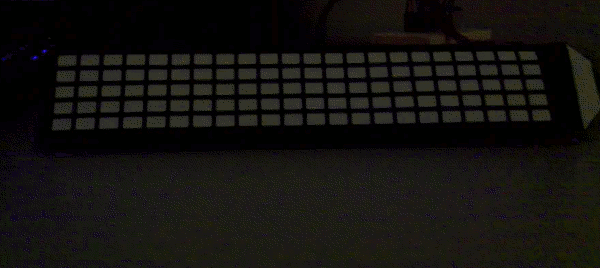
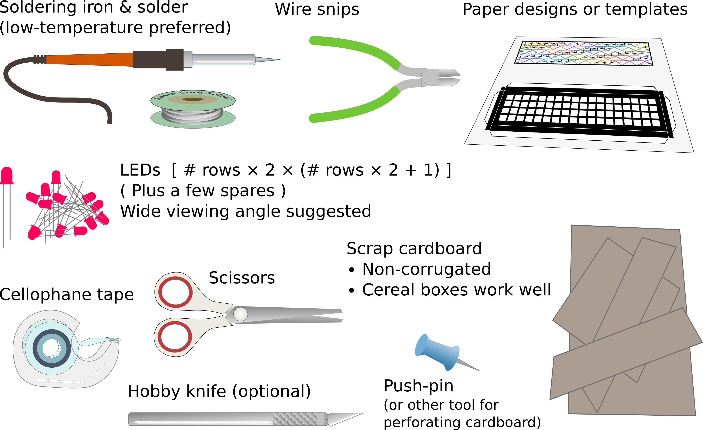
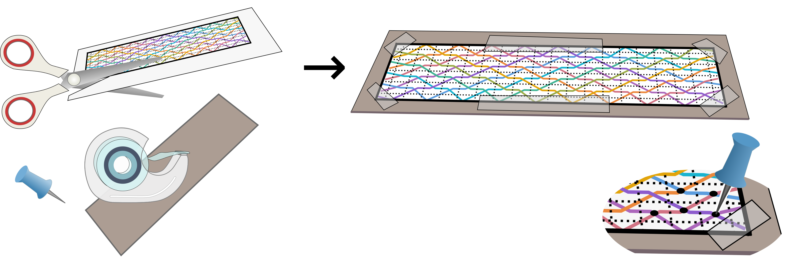
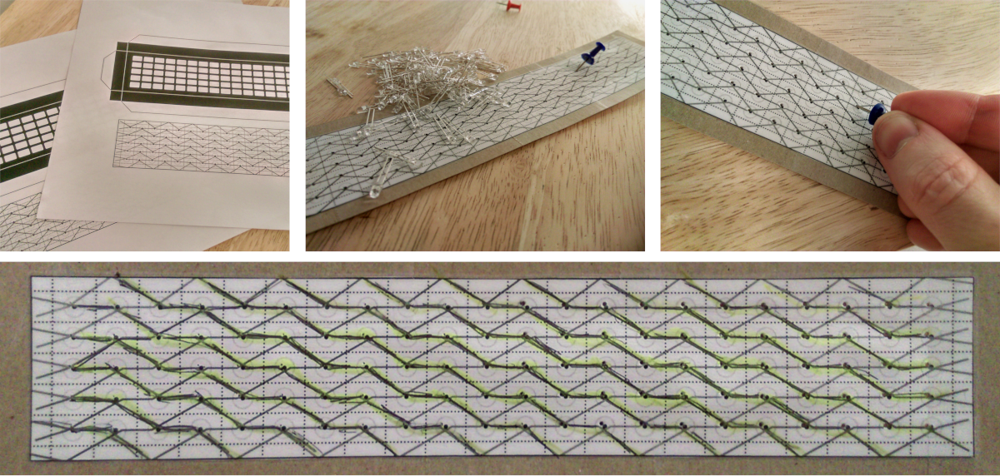
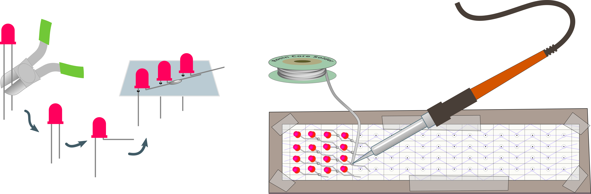
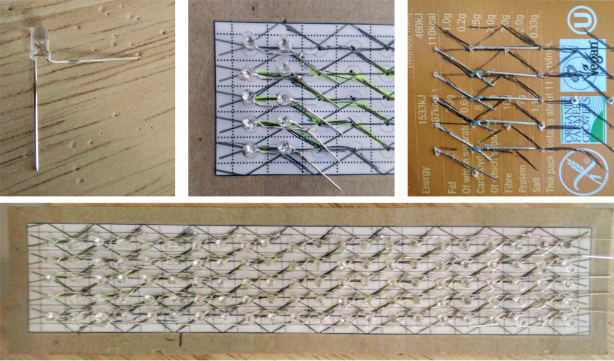
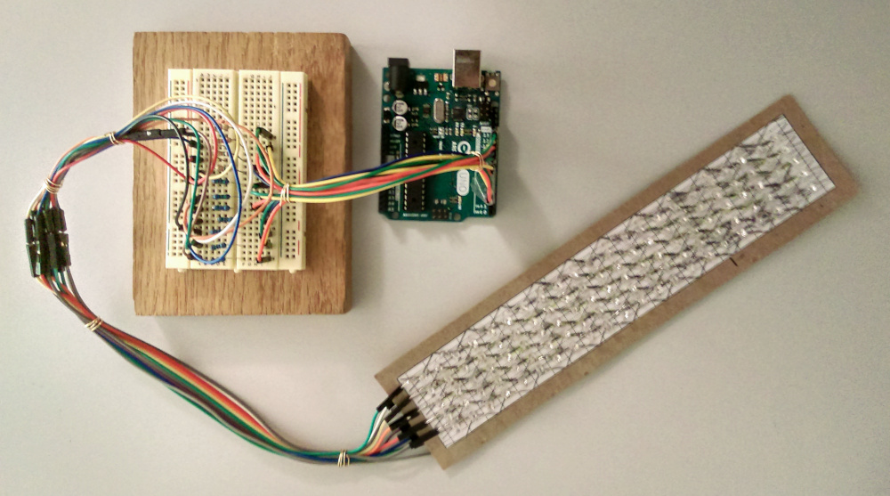
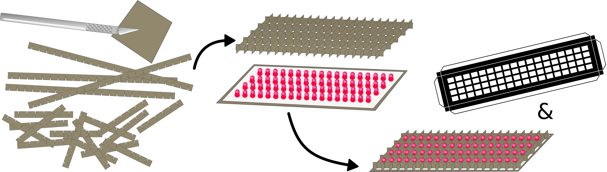

# Paper Marquee 0.2

It's winter here again, and long dark nights demand some tinkering and crafts. Arduino LED projects are fun, but prefabricated modules and circuit boards might not always be in the budget. 
Thankfully, discrete LEDs can be found on Ebay for less than 1¢ apiece, in bulk, and [cardboard circuits](https://www.sparkfun.com/news/2546) are a thing. Can we build a [scrolling marquee display](http://wealoneonearth.blogspot.com/2013/02/diy-tinymarquee-attiny24-based.html) with nothing more than some LEDs, cardboard, and paper?

## Yes, we can!

# Approach

We'll lay out and solder our LED marquee on cardboard, and build some dividers to contain the light, and print a little screen on top to diffuse the light. We will use a ["Charlieplexing"](http://wealoneonearth.blogspot.com/2013/03/design-note-charlieplexing-led-matrices.html) layout to control many LEDs using only a few pins. This can be a difficult to lay out by hand. Thankfully, there is a trick: if we're willing to [tilt the grid diagonally](http://crawlingrobotfortress.blogspot.com/2019/02/led-multiplexing-layouts-for-hand.html), we can use a pattern that is easy to layout and assemble. The code to drive the display gets a bit confusing, but one can always manually map the LED locations one-by-one, if push comes to shove. 

# Step 0: Gather materials

I recommend fairly bright LEDs, since the paper diffuser blocks some light. "Super bright" LEDs inside a clear packaging should do. "Hat top" LEDs are nice because they cast light in all directions, making it easier to get a good display even if all the LEDs aren't *quite* aligned. 

Other materials needed include a soldering kit and wire snips, as well as paper crafting supplies: scissors, tape, paper, scrap cardboard, and a hobby knife. We'll also use a pin to punch holes in the cardboard for the LEDs. Oh! and an Arduino, jumper wires, and current limiting resistors as well, of course. 

 - LEDs (110 in this build), scrap wire, current-limiting resistors, and an Arduino
 - Soldering station, wire snips, low-temperature solder
 - Paper crafting tools: scissors, tape, x-acto knife, push pin
 - Scrap cardboard, paper, pen, printer 

## Step 1: Prepare circuit (card)board

First, we'll need to design our layout. We'll use a [diagonal version of charlieplexing](https://crawlingrobotfortress.blogspot.com/2019/02/led-multiplexing-layouts-for-hand.html), to simplify soldering. Design files for this project are on [github](https://github.com/michaelerule/LED_weaving). I used [this template](https://github.com/michaelerule/LED_weaving/blob/master/Project%202:%20Marquee/Templates/Marquee_11_combined.pdf). 

For ["diagonal multiplexing"](https://crawlingrobotfortress.blogspot.com/2019/02/led-multiplexing-layouts-for-hand.html), we'll have the cathodes on the front of the board, zigzagging diagonally, and the anodes on the reverse, zigzagging the other way. The lines wrap around at the edges. This can be a bit confusing at first, so reading through the blog post and working through some layouts by hands might be helpful!

For the cardboard, we want something stiff but not to thick. Cereal boxes are perfect. Tape the template to cardboard, or draw the pattern by hand. Use a thumb-tack or push-pin to poke **one** hole in the cardboard for each LED (just one hole as we'll wire up the other pins on the front). 

After punching holes for the LED leads, trace the circuit on the reverse, for reference when soldering. 

## Step 2: Solder LEDs

I wired up the anodes (positive, +, usually the long wire) on the reverse, and the cathodes (negative, -, usually near the flat edge of the LED) in the front. It doesn't matter whether the anodes or cathodes are on the front/back, but it does matter that *all LEDs go the same way*. Be careful not to switch any!

Without a rigid PCB, the LEDs get a bit wobbly, which makes soldering tricky. I soldered the LEDs one row at a time, soldering both the front and the back of the board, so that the previously-soldered LEDs are held stiffly in place.

Test the LEDs as you go, making sure that they light up as expected. It's easier to correct fixes *before* the whole matrix is soldered in to place. 

## Step 3: Test circuit

After step 2, you may want to pause and test that all LEDs are working well. If your following this example, you should have 11 control lines controlling a 5x22 LED matrix. 

You'll need to write some code to scan the LEDs. Scanning them one at a time (at first) is useful. When testing, [*use current limiting resistors, and calculate the resistance correctly for the color of LEDs you used*](https://www.sparkfun.com/tutorials/219). To be conservative, I used 330Ω resistors. It is very sad to burn out all your LEDs after spending all that time soldering them. [This online resistor calculator](https://www.digikey.com/en/resources/conversion-calculators/conversion-calculator-led-series-resistor) is handy.

To get a brighter display, you might want to consider row-column driving, rather than lighting the LEDs one at a time. This is a bit out-of-spec in a charlieplexing setup, since each pin on the Arduino is only *technically* supposed to source or sink 40mA of current. So far, I haven't had any issues with it. 

Once everything is working well, you can consider lowering the current resistors to match the peak current of the LEDs. Most LEDs can handle extra current briefly. If you're scanning a multiplexed display rapidly, LEDs will be on only a fraction of the time. Lowering the current limiting resistor increases the power, and the brightness, of the display. Still, take care not burn out the display! 

## Step 4: Bulid case

We need to build a case for the LED matrix, to help confine and diffuse the light, and give everything a polished look (or as polished as can be, for a paper marquee).

To divide the light between LEDs, I cut thin strips of cardboard. These should be only slightly taller than the LEDs themselves, to avoid absorbing excess light. These strips then supported a paper overlay, which helps diffuse the light and blacks out any regions except for the "pixels". 

The paper dividers leak light, and the paper overlay absorbs too much, so things are dimmer and fuzzier than on a proper LED marquee, but it looks good in dark or dim indoor light!

## Step 4: Enjoy!

Now that we have our "papercraft" LED marquee, we can play around with programming it. I enjoyed designing various bitmap fonts, and hooking up to the serial port on a computer to print outputs from the command line.

I used a regular Arduino at first, but eventually affixed an [Arduino pro mini](https://store.arduino.cc/usa/arduino-pro-mini) for a more stand-alone solution. At the moment, I've hooked it up to battery power and set it to scroll some poetry.

