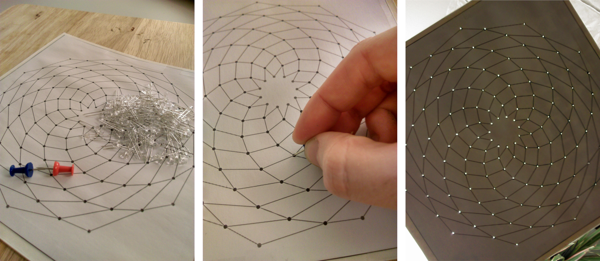
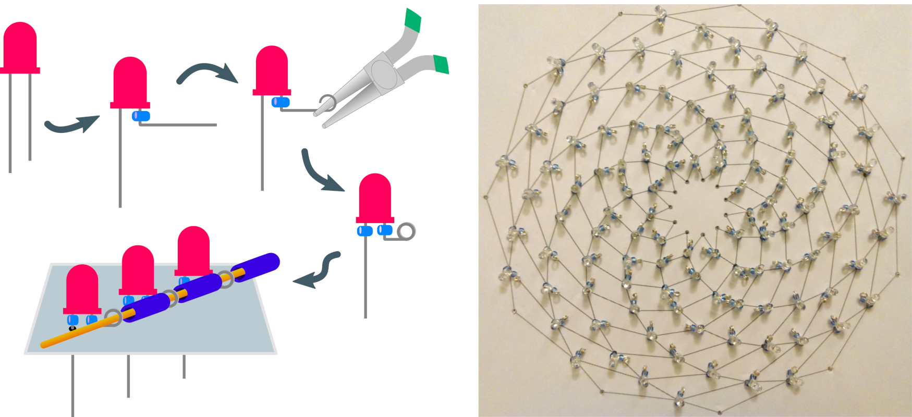
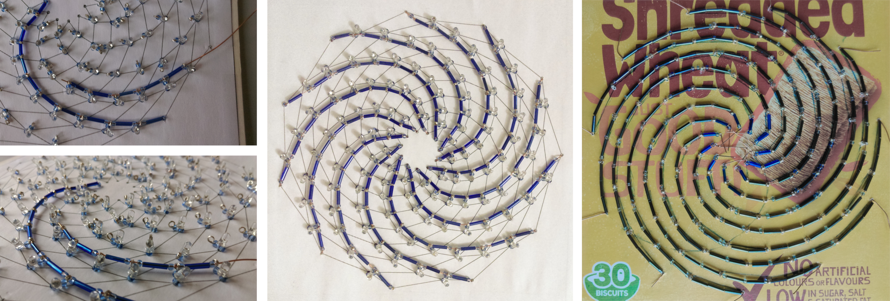
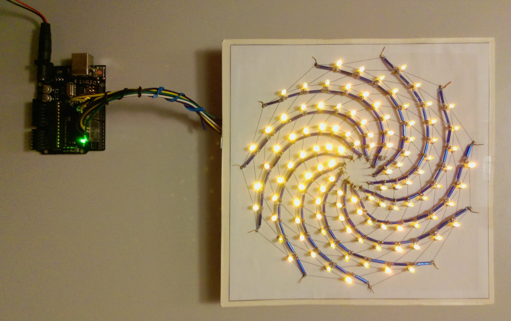
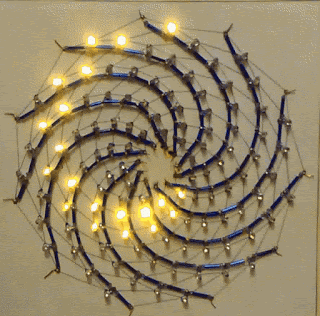
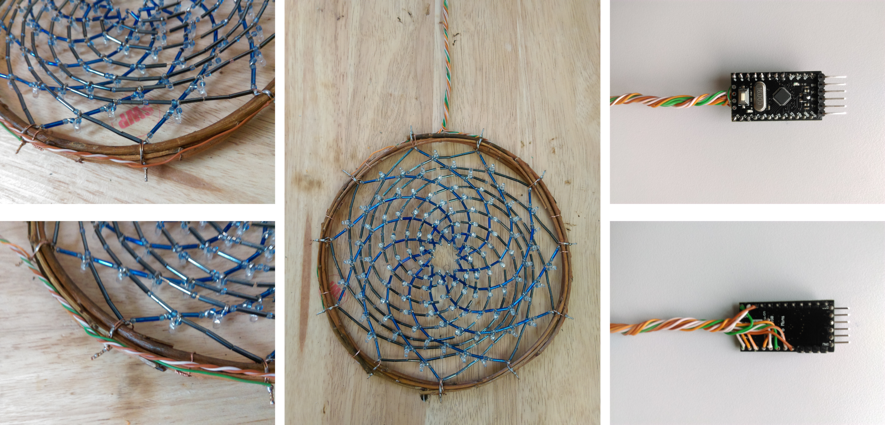

# Dreamcatcher

The winter solstice is soon, and I think something beautiful is in order. In this post, I'll outline how to construct a [dreamcatcher](https://en.wikipedia.org/wiki/Dreamcatcher) that also functions as an LED display. For this design, we'll use a ["charlieplexing"](http://wealoneonearth.blogspot.com/2013/03/design-note-charlieplexing-led-matrices.html) layout to drive many LEDs with few pins. There is a [version of the charlieplexing layout](http://crawlingrobotfortress.blogspot.com/2019/02/led-multiplexing-layouts-for-hand.html) that works well with the spiral pattern used for our dreamcatcher. The construction approach is similar to the [paper LED marquee project](https://crawlingrobotfortress.blogspot.com/2019/12/paper-marquee-02.html).

# Step 0: Materials

 - Willow branches, tied and dried around a small-medium sized kitchen pot to hold a circular shape
 - LEDs, at least 110. Bright, clear packaging, preferred
 - glass "bugle" (long thin) and "seed" (small, round) beads
 - Bare copper or brass wire, intermediate guage: small enough to thread through beads easily
 - Soldering tools
 - Scrap paper and cardboard, scissors, thumbtack, hobby knife, printer
 - Arduino and hookup wires

# Step 1: Prepare the "circuit board"

For this project, I opted for a pattern based on 100 LEDs controlled by 11 pins. I used [this template](https://github.com/michaelerule/LED_weaving/blob/master/Project%203:%20Fibonacci/Templates/Sunflower_11_110_LEDs.pdf), were made by the [`Fibonacci_layout.ipynb` iPython notebook, available on Githiub](https://github.com/michaelerule/LED_weaving/blob/master/Project%203:%20Fibonacci/Templates/Fibbonaci_layout.ipynb). This pattern is based on the golden ratio, and is adjusted so that the density of LEDs is approximately uniform (with some distortion near the center. )

Tape the template to some scrap cardboard (cereal boxes seem to work well), and use a push-pin or thumbtack to punture holes for the LEDs. 

# Step 2: Add LEDs

We will affix the LEDs to the board, and then thread wire and beads through them to make electrical connections. I used [round nosed pliers](https://en.wikipedia.org/wiki/Round-nose_pliers) to shape the LED leads into loops. 

One problem I had with [previous attempts at LED bead weaving](http://crawlingrobotfortress.blogspot.com/2019/02/led-multiplexing-layouts-for-hand.html) was damage to the LEDs during soldering, due to heat and mechanical stress. To fix this, I added glass [seed beads](https://en.wikipedia.org/wiki/Seed_bead) as spacers. Spacer beads allow a bit more distance between the solder point and the LED itself, and dissipate some heat and mechanical stress. 

Add a spacing seed bead and shape the top loop first (I kept the anodes on the top). Add another spacing bead to the other lead, insert the LED into the "board", and shape the lead on the back. It is also possible (and probably easier, to be honest)  to wrap the LED leads around the wires as you solder them, although I have not tried this approach.

# Step 3: Wire up circuit with beads

We'll use medium-gauge bare copper or brass wire to hook up the LEDs. To make things beautiful, and to insulate the driving wires to prevent shorts, we'll wrap the wire in glass [bugle and seed beads](https://en.wikipedia.org/wiki/Seed_bead#Bugle_beads). 

 - Use a wire that is thin enough to thread through the beads easily, but thick enough that it won't break from fatigue.
 - Avoid excessive force; this could crack the glass beads or damage the LEDs. 
 - Leave 2-3 mm clearance around each LED lead, to make sure there is space to solder propely.

I found it necessary to carefully pull the wire through the beads with pliers, as it did not slide easily. Using thinner wire seemed to help. 

Prepare the reverse similarly.

# Step 4: Solder and electrical test

Solder the LEDs to the wires. With this specific template, the driving lines for the front and for the back meet at the center and the perimeter. Solder these together as well. 

Remember to use the correct [current-limiting resistors](https://www.sparkfun.com/tutorials/219) to avoid burning out the (painstakingly assembled) LEDs. The resistor calculator [here](https://www.digikey.com/en/resources/conversion-calculators/conversion-calculator-led-series-resistor) is nice.

All working! (almost)

# Step 5: Mounting

Remove the cardboard support. This must be done with care to avoid damaging the LEDs or the circuit. I peeled away the paper with pliers, 1-2 millimeters at a time. The patience is worth it, since at this point, it would be very difficut to repair any damage. 

Using short pieces of copper wire, tie several willow branches together to form a circle. I used branches that had been formed in a roughly circle by tying them around a kitchen pot as they dried. A more circular shape was possible by tying several branches together and tightening things incrementally.

Attach the LED bead dreamcatcher to the willow loop using wire ties. Space these evenly around the circumference, one for each driving line (I'm using 11). Leave the ties loose at first. Once all are in place, slowly and incrementally [tighten them in a star pattern, as you would a lug nut](https://en.wikipedia.org/wiki/Lug_nut). This should further pull the willow loop into a circular shape. Do not over-tighten, and be careful not to damage the circuit.

Run insulated wire around the willow loop to connect each of the driving lines. Old ethernet cables are an excellent source of twisted pair copper wire, and that's what I used here. Another useful trick for cable management [twisting two strings together to form a larger rope](https://www.wikihow.com/Make-Rope). One nice thing about Charlieplexing is how few driving lines it uses: all 110 LEDs here can be driven with a single cable. 

# Step 6: Software 

Once everything is hooked up to the Arduino ([pro mini](https://store.arduino.cc/usa/arduino-pro-mini) in this case), you can start to play around with programming. In this case I got a bit lazy, and hastily ported some old [game of life](https://en.wikipedia.org/wiki/Conway%27s_Game_of_Life) code, with some added zooming and rotation. It's not quite right, but it looks nice.

Overall? Not bad for \$5.50

 - LEDs: \$1 from ebay; 
 - Pro-mini compatible: \$2 from Ebay. 
 - Beads: \$1.50 from Ebay
 - Copper wire: \$1 from Ebay
 - Cardboard and paper: scavenged
 - Willow branches: free
 - Insulated wire: scavenged
 - Soldering and crafting supplies: already available. 