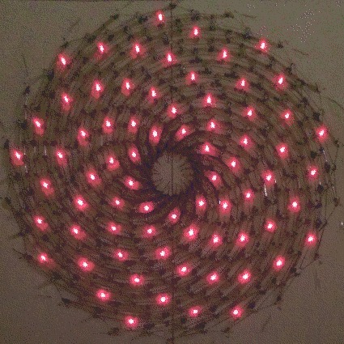

[ THUMBNAIL GRAPHIC HERE MAKE FIRST FRAME SEXY ]


# Microcontroller firmware for Charlieplexed LED displays

With coronavirus lockdown in full effect, I find myself in search of quiet immersive hobbies to pass the time and distract from the news. Building LED displays by hand will do!

Previous posts illustrated hardware ideas for building [Charlieplexed](https://en.wikipedia.org/wiki/Charlieplexing) displays ([1](http://crawlingrobotfortress.blogspot.com/2013/03/charlieplexing-with-led-dot-matrix.html)
 [2](https://crawlingrobotfortress.blogspot.com/2013/02/cross-post-diy-tinymarquee-attiny24.html)). Recent posts on [constructing displays efficiently by hand](http://crawlingrobotfortress.blogspot.com/2019/02/led-multiplexing-layouts-for-hand.html) ([3](http://crawlingrobotfortress.blogspot.com/2019/12/paper-marquee-02.html)
[4](http://crawlingrobotfortress.blogspot.com/2019/12/dreamcatcher.html)) are especially useful in these times, since board fab houses face shutdowns and delays due to the pandemic. Bulk LEDs are still available on Ebay from regional sellers, and the postal service continues to operate in most regions. However, building the display hardware is only half the work: one also needs a display driver.

This post covers strategies for writing firmware to drive Charlieplexed LED displays. I'll be working with the [Arduino Uno](https://en.wikipedia.org/wiki/Arduino_Uno), which uses the [AtMega328 microcontroller](https://en.wikipedia.org/wiki/ATmega328P), and which I suspect many of you will already have at home. These strategies are general, but the hardware-specific optimizations will need to be adapted if using a different microcontroller.

## 1. Test the display one light at a time

One you've built the display, the first thing to do is to verify that all LEDs work.

Before starting, ensure that all control lines have appropriate [current-limiting resistors](https://www.sparkfun.com/tutorials/219) to avoid damaging the LEDs. Speaking from experience, it is very frustrating to burn out
a LED matrix before even getting started! 

Throughout this tutorial, I'll be working on a 306-light project that uses 18 control lines (the maximum number that one can use on the Arduino Uno while still leaving the serial pins free). I've arranged the display in a circular pattern based, but these code examples will assume an ordinary rectangular layout for simplicity.

The Arduino sketch below will light-up each LED in a Charlieplexed display in sequence. Follow the steps in the top comment to adapt it to your project.


```c
/**
 *  - Build Charlieplexed display hardware
 *  - Hook up all lines with appropriate current-limiting resistors
 *  - Set the constant NPINS to the number of lines
 *  - Place the Arduino pin numbers used in the `pinmap` array
 *  - Upload this sketch and confirm that all lights work
 */

#define NPINS 18
const int pinmap[NPINS] = {
  2,3,4,5,6,7,8,9,10,11,12,13,14,15,16,17
};

void setup() {
  // put your setup code here, to run once:
}

void loop() {
  // put your main code here, to run repeatedly:

  for (int j=0; j<NPINS; j++)
  for (int i=0; i<NPINS; i++)
  {
    if (i==j) continue;
    int anode   = pinmap[i];
    int cathode = pinmap[j];
    // Turn everything off
    for (int line=0; line<NPINS; line++)
      pinMode(pinmap[line],INPUT);
    // Turn on one anode-cathode pair
    digitalWrite(cathode,LOW );
    digitalWrite(anode  ,HIGH);
    pinMode(anode  ,OUTPUT);
    pinMode(cathode,OUTPUT);
    delay(1);
  }
}
```

Before turning on the next light, we first set all pins to `INPUT` mode, with pull-up resistors disabled. This avoids triggering any LEDs accidentally as we switch the other pins.


The full working sketch is given in [Example 1]()

#### Dead pixels


For home-made displays, I usually have a few LEDs that are burnt out or installed backwards. Thesting the display will reveal such 'dead pixels', and now is good time to replace or re-solder them. 


In Charlieplexed displays, attempting to light a dead pixel will cause current to flow in unexpected ways, spuriously lighting up the wrong LEDs. Sometime it is impractical to replace broken LEDs. For now, it suffices to note the anode and cathode pin numbers of any dead pixels. We can explicitly avoid turning them on in the display driving code late to avoid this issue.

> *Note: Watch out for quality control in bulk discrete LEDs. I usually find some where the anode/cathode labels are reversed, or where the LED isn't embedded properly in the plastic housing. (Mechanical stability is especially important for home-made projects, since movement during use or soldering can break the connection between the LED chip and its leads.) For this reason, I often check each LED before soldering.*

## 2. Row/column scanning

Lighting LEDs individually works for small projects, but not for large ones (>50 LEDs). As the number of lights increases, the fraction of time that each light spends on decreases, making the display dim. There also isn't enough time to scan a large number of lights without introducing noticeable flicker.

The solution is to scan an entire row or column of the matrix at once. One can drive multiple LEDs simultaneously by (e.g.) turning on one anode and multiple cathodes. When doing this, take care not to over-current the microcontroller IO pins. Appendix 1 (at the end of this post) gives notes for setting resistor values, but the usual series resistance for lighting a single LED is a good upper bound.


#### Single-light scanning
 - **Good:** If only a sparse subset of the LEDs are on at a given time, this can lead to a brighter and more uniform display.
 - **Bad:** The display will be dim if there are many LEDs to scan, and this approach fails if a large number LEDs need to be lit.

#### Row/Column scanning
 - **Good:** Reduces the amount of CPU time needed to scan the display. Reduces flicker and increases brightness for large displays.
 - **Bad:** Current-limiting resistors set a fixed current per row or column. This means that the brightness depends on the number of LEDs being lit per row/column, which can lead to non-uniform brightness if not compensated in software. Handling displays that mix LEDs with different forward voltages is also more complicated.

Here is an Arduino sketch to test common-anode row/column scanning of a Charlieplexed display. Set `NPINS` to the number of LED control lines in your project, and define the Arduino pin number for each line in the `pinmap` variable.
    
```c
/**
 *  - Set up the electronic circuit, with appropriate series resistors
 *    to protect the LEDs *and* *microcontroller* if something goes wrong.
 *  - For common-anode row/column scanning:
 *    - Set all pins to INPUT mode to avoid spuriously lighting LEDs
 *    - Set the anode pin to HIGH and all others to LOW
 *    - Switch to OUTPUT mode the anode, and any cathods from this row
 *      that you wish to light up.
 */

#define NPINS 18
const int pinmap[NPINS] = {
  10,6,18,15,12,4,5,8,7,16,17,19,14,9,11,13,3,2
};

void setup() {
  // put your setup code here, to run once:
}

void loop() {
  // put your main code here, to run repeatedly:
  for (int i=0; i<NPINS; i++)
  {
    int anode = pinmap[i];

    // Turn eveything off
    for (int line=0; line<NPINS; line++)
      pinMode(pinmap[line],INPUT);

    // Set cathodes to LOW and anode to HIGH
    for (int line=0; line<NPINS; line++)
      digitalWrite(pinmap[line],LOW );
    digitalWrite(anode,HIGH);

    // Turn on Anode, and any cathodes we want to light-up
    pinMode(anode,OUTPUT);
    for (int line=0; line<NPINS; line++)
      pinMode(pinmap[line],OUTPUT);

    delayMicroseconds(200);
  }
}
```


The full working sketch is given in [Example 2]()

## 3. Display buffers

At this point, we've tested that the display works electrically, and are ready to start coding a display driver. The first step is to add a display memory buffer, so that other drawing routines can turn pixels on and off.

We'll do this by storing one bit for each directed pair of LED control lines. We'll pack this display memory into an array of 32-bit integers, so that if the LED between line $i$ and $j$ is on, then the $j^\text{th}$ bit of the $i^\text{th}$ column will be `1` (and `0` otherwise). This background on [bitwise manipulations](https://playground.arduino.cc/Code/BitMath/) in integers might be useful. 

Bit-packed representations save on memory, and (as we shall see in the next section) speed up IO operations, both important on microcontrollers with limited RAM and slow clocks. Since I have 18 control lines, I use a 32-bit unsigned integer (`uint32_t` or `unsigned long` on the Arduino). If you have fewer control lines, e.g. $\le$16, you can save space by using `uint16_t` (`unsigned int` on Arduino), or `uint8_t` if $\le$8 lines.

In the sketch below, we've modified the row/column scanning example

 - We add an array of unsigned integers, which store the bits of our display buffer
 - We explicitly clear the buffer in the `setup()` part of the sketch
 - We draw a test pattern into the buffer
 - In the row-column scanning loop, we now check the display buffer to see which lights to turn on for each row.

The code: 
    
```c
/**
*  This sketch extends Example 2, row-column scanning,
*  to read data from a display buffer.
*/

#define NPINS 18
const int pinmap[NPINS] = {
  10,6,18,15,12,4,5,8,7,16,17,19,14,9,11,13,3,2
};

uint32_t display_buffer[NPINS];

void setup() {
  // Initialize the display memory
  for (int line=0; line<NPINS; line++)
    display_buffer[line]=0;

  // Draw a test pattern
  for (int i=0; i<NPINS; i++)
    for (int j=0; j<NPINS; j++)
      if (i!=j && ((i>>2)&1)==((j>>2)&1))
        display_buffer[i] |= 1<<j;
  }

void loop() {
  // scan based on the information in the buffer
  for (int i=0; i<NPINS; i++)
  {
    // Turn eveything off
    for (int line=0; line<NPINS; line++)
      pinMode(pinmap[line],INPUT);

    // Set cathodes to LOW and anode to HIGH
    int anode = pinmap[i];
    for (int line=0; line<NPINS; line++)
      digitalWrite(pinmap[line],LOW );
    digitalWrite(anode,HIGH);

    // Turn on Anode, and any cathodes we want to light-up
    pinMode(anode,OUTPUT);
    for (int line=0; line<NPINS; line++)
      if (display_buffer[i]>>line&1)
        pinMode(pinmap[line],OUTPUT);

    delayMicroseconds(200);
  }
}
```


The full working sketch is given in [Example 3]()

## 4. Tight loops: optimize it

So far, we've been setting the states of the IO pins individually. This is a bit slow, so let's optimize things. On most microcontrollers IO lines are grouped into "ports", each of which contains 8 IO pins. One can set the state of all 8 pins simultaneously by writing an 8-bit integer to the port. I'm using an AtMega328-based board, which has three ports (B, C, and D). Quoting the [Arduino tutorial on port manipulation](https://www.arduino.cc/en/Reference/PortManipulation), each port is controlled by three registers:

 - The `DDR` register sets whether pins are in input or output mode  (`1` means `OUTPUT`, `0` means `INPUT`)
 - The `PORT` register controls whether pins are high or low, in output mode, and controls whether the internal pull-up resistor is active in output mode (`1` means `HIGH`, `0` means `LOW`)
 - The `PIN` register is used to read input (we won't use this)

On this project, I'm using Arduino pins 2-17. We need to refer to the [Arduino pin mapping](https://www.arduino.cc/en/Hacking/Atmega168Hardware) to identify which ports these correspond to.

 - Pins 2-7 correspond to PORTD 2-7
 - Pins 8-13 correspond to PORTB 0-5
 - Pins 14-19 correspond to PORTC 0-5
 
### Subroutines for fast IO

First, write some helper functions to set all of the `PORT` or `PIN` states for these pins at once, based on a single bit-packed representation of the IO state. This encapsulates the translation from a bit-packed representation of the LED-control line states into a sequence of `PORT` or `DDR` register writes, simplifies the display driver design.

```c
// Set the PORT (HIGH/LOW) status of all LED control lines
inline void PORT_LED(uint32_t states) {
  PORTD = (PORTD & 0b11) | ((states & 0b111111)<<2);
  states >>= 6;
  PORTB = states & 0b111111;
  states >>= 6;
  PORTC = states & 0b111111;
}

// Set the DDR (INPUT/OUTPUT) status of all LED control lines
inline void DDR_LED(uint32_t states) {
  DDRD = (DDRD & 0b11) | ((states & 0b111111)<<2);
  states >>= 6;
  DDRB = states & 0b111111;
  states >>= 6;
  DDRC = states & 0b111111;
}
```

> *Notes:*
>
> - *The `inline` in these function declarations tells the compiler to insert their instructions directly in any calling function, eliminating function-call overhead (although the compiler is free to ignore this).*
>
> - *When we write to port D, we first read and copy the value of the first two bits. These are the port states for Arduino pins `0` and `1`. Since I'm not using these pins for the display, I need to leave their values unchanged. In your project, you'll need to do this for any pins sharing a port with the LED lines, if those pins are being used for other functions.*

### Preparing display data for faster IO

Now, we need to prepare bit-packed IO states to send to these subroutines. Mapping from LED control lines to pins takes time, so we don't want to do this inside the display scanning loop. One solution is to ensure that your LED control lines are hooked up in a sensible way to the underlying ports, but this isn't always possible. 

A more flexible solution is to store the `display_buffer` memory in a format that is convenient for scanning the display, and handle the pin-to-line mapping when we read/write pixels from the display buffer. 

The advantage of this approach is that Charlieplexing layouts [can be a  bit weird](http://crawlingrobotfortress.blogspot.com/2013/03/charlieplexing-with-led-dot-matrix.html) in terms of how pixels map to control lines. So, the code to translate pixel location into the location in the Charlieplexing grid isn't always trivial. By handling this is wrapper functions that read/write display memory, we can hide all this messiness and expose a clean interface in terms of pixel coordinates.

```c
// Write a 1-bit pixel to display memory
void setPixel(int i, int j, int value) {
  // (add code to convert pixel to display coordinates here)
  if (value)
    display_buffer[pinmap[i]] |=  ((uint32_t)1)<<pinmap[j];
  else
    display_buffer[pinmap[i]] &=~(((uint32_t)1)<<pinmap[j]);
}

// Read a 1-bit pixel from display memory
int getPixel(int i, int j) {
  // (add code to convert pixel to display coordinates here)
  return (display_buffer[pinmap[i]]>>pinmap[j])&1;
}
```

The code to scan the display is now relatively simple:

```c
for (int i=0; i<NPINS; i++)
{
  // Turn eveything off
  DDR_LED(0);

  // Set cathodes to LOW and anode to HIGH
  uint32_t anode_mask = ((uint32_t)1)<<i;
  PORT_LED(anode_mask);

  // Turn on those LEDs which are on
  DDR_LED(anode_mask | display_buffer[i]);    

  delayMicroseconds(200);
}
```

A full working sketch is given in [Example 4]()

## 5. Timer interrupts for multi-tasking

For uniform brightness and to avoid flicker, we need to scan through the rows of the display at regular intervals. But, if our main loop is dedicated to the display driver, we can't really handle much computation for actually showing things on the display!

The solution is to move the display scanning code into a timer interrupt routine that is called at regular intervals. There is a good introduction to timer interrupts for the Arduino on [Adafruit](https://learn.adafruit.com/multi-tasking-the-arduino-part-2/timers), and *Appendix 2* goes into more detail. For this example we'll use the AtMega's Timer 2 for scanning the display. This works provided we do not also use the [Tone library](https://www.arduino.cc/reference/en/language/functions/advanced-io/tone/), which needs Timer 2 for other purposes.

To trigger the timer interrupt routine, we need to set up Timer 2
and enable the Timer 2 overflow interrupt. I've wrapped this and the display-buffer initializer code in a new function `setup_display()`, which is called when the device starts.

```c
void setup_diplay() {
  // Initialize the display memory
  for (int line=0; line<NPINS; line++)
    display_buffer[line]=0;

  // Set up Timer2 interrupts
  // Timer/counter 2 control register A
  // Set to 0 do disable PWM and output-compare functions
  TCCR2A = 0;
  // Timer/counter 2 control register B
  // The first 3 bits control the prescaler
  // (i.e. clock divisor for timer tics)
  // 0:off     4:64
  // 1:1       5:128
  // 2:8       6:256
  // 3:32      7:1024
  //
  TCCR2A = 3;
  // Enable the Timer 2 overflow interrupt
  // Timer/Counter2 Interrupt Mask Register
  TIMSK2 = 1;
}
```

We then place our display scanning code inside the Timer 2 overflow interrupt signal handler:

```c
// Interrupt handler for scanning the display
volatile int scan_line = 0;
SIGNAL(TIMER2_OVF_vect) {
  // Reset timer; 
  // We want to update 18 rows at 400 Hz
  // I used the following python code to calculate
  // the reset value, using a prescaler of 32.
  //
  // >>> CLOCKRATE = 16e6 # 16 MHz system clock
  // >>> NLINES    = 18   # 18 LED control lines
  // >>> RATE      = 400  # Hz; Display scan rate
  // >>> PRESCALE  = 32   # Timer prescaler
  // >>> TIMERMAX  = 256  # 256 if 8-bit, 65536 if 16-bit timer  
  // >>> trigger_every = (CLOCKRATE/PRESCALE)/(NLINES*RATE)
  // >>> reset_to      = int(TIMERMAX-trigger_every+0.5)
  // >>> print('Reset the 8-bit timer to %d'%reset_to)
  TCNT2 = 187;
  // Scan one row of the display
  DDR_LED(0);
  uint32_t anode_mask = ((uint32_t)1)<<scan_line;
  PORT_LED(anode_mask);
  DDR_LED(anode_mask | display_buffer[scan_line]);    
  scan_line++;
  if (scan_line>=NPINS) scan_line=0;
}
```

To achieve finer control over the scanning rate, one can manually reset the timer in the overflow signal handler. Here, I set it to 187, which means the timer will overflow (i.e. reach 256) again in 256-187=69 timer tics.

With the display-driving code out of the way, one can now add interesting rendering code in the main program loop. As a first test, I've set it to randomly change pixel values:

```c
void loop() {
  // The main loop is now free for implementing program logic
  // For example we can randomly flip some LEDs
  setPixel(random(NPINS),random(NPINS),random(2));
}
```

A full working sketch is given in [Example 5]()

## 6. Double buffering for better animations

Updating pixels one at a time can cause artifacts when drawing a new frame to the display. For cleaner animations, one can use [double buffering](https://en.wikipedia.org/wiki/Multiple_buffering#Double_buffering_in_computer_graphics) to draw the frames off-screen first, then show them all at once.

We define two copies of the display buffer (`buffer1` and `buffer`), as well as two pointers, one for drawing and one for scanning the display. We alternate which pointer points to which buffer to achieve double-buffering.

```c
uint32_t buffer1[NPINS];
uint32_t buffer2[NPINS];
uint32_t *display_buffer;
uint32_t *drawing_buffer;

// FLip display and drawing buffers
void flipBuffers() {
  uint32_t *temp = display_buffer;
  display_buffer = drawing_buffer;
  drawing_buffer = temp;
}
```

The `setPixel` and `getPixel` (section 4) routines are modified to use to accept a buffer pointer as a parameter.

```c
// Write a 1-bit pixel to display memory
void setPixel(uint32_t *buff,int i, int j, int value) {
  // (add code to convert pixel to display coordinates here)
  if (value)
    buff[pinmap[i]] |=  ((uint32_t)1)<<pinmap[j];
  else
    buff[pinmap[i]] &=~(((uint32_t)1)<<pinmap[j]);
}

// Read a 1-bit pixel from display memory
int getPixel(uint32_t *buff,int i, int j) {
  // (add code to convert pixel to display coordinates here)
  return (buff[pinmap[i]]>>pinmap[j])&1;
}
```
   
In the initialization code, we assign the underlying buffers to the display/drawing pointers, and clear both display memories:

```c
// Start with buffer 1 for display
// and buffer 2 for drawing.
display_buffer = &buffer1[0];
drawing_buffer = &buffer2[0];

// Clear the display memory
for (int line=0; line<NPINS; line++)
  buffer1[line]=buffer2[line]=0;
```

This lets us prepare the next frame off-screen, and show it all at once. For example, we can randomly flip some LEDs:

```c
for (int i=0; i<NPINS; i++)
  for (int j=0; j<NPINS; j++)
    if (i!=j)
      setPixel(drawing_buffer,i,j,random(2));
flipBuffers();
delay(500);
```

> *Note: I'm still using the Charlieplexing grid coordinates for `i` and `j`, rather than screen coordinates. For this reason we skip the `i==j` slots, since these would correspond to the anode and cathode being the same pin. In your own project, you would use `i` and `j` in display coordinates, and add code in  `setPixel` and `getPixel` to map these to Charlieplexing-grid coordinates.*

A full working sketch is given in [Example 6]()

 Without double buffering         |  With double buffering
:--------------------------------:|:----------------------------------:
  |  

> *Note: One can also [synchronize the buffer-flips with the display driver](https://en.wikipedia.org/wiki/Screen_tearing#Vertical_synchronization). This avoids updating the display halway through the scan. However, there really isn't a natural place to flip the buffers in the 'diagonal multiplexing' layout approach I'm using here, so I omit this.*


# Additional extensions


## Extension 1: Multiple brightness levels (more than 1-bit per pixel)


If you have CPU cycles to spare, then one can vary the brightness of pixels via [PWM](https://en.wikipedia.org/wiki/Pulse-width_modulation). This is a tricky, however, since for $N$ control lines we're already effectively PWM-ing each LED with a duty cycle of $1/N$. In my experience it is difficult to get more than 3 distinct brightness levels. 

The way to do this is to scan through the display multiple times. The brightest LEDs will be lit during all scans, but we'll skip intermediate-brightness LEDs during some of the scans. 

For this example, I've implement 2-bit color, which supports four states: "off", and then three brightness levels. Human brightness perception [is nonlinear](https://en.wikipedia.org/wiki/Gamma_correction), so I double the amount of time each light is on for each brigtness increment. 

 - Scan 1: Duration `10` timer ticks
 - Scan 2: Duration `10` timer ticks
 - Scan 3: Duration `20` timer ticks

 - Pixel value `0`, i.e. `0b00`: Always off.
 - Pixel value `1`, i.e. `0b01`: On during scan 1 for 10 cycles.
 - Pixel value `2`, i.e. `0b10`: On during scans 1 and 2, for a total of 20 cycles.
 - Pixel value `3`, i.e. `0b11`: On during all scans, for a total of 40 cycles.

An example sketch is given in [Extension 1]()

## Extension 2: Driving multiple LED colors in the same grid

If you mix LEDs with different forward voltages (e.g. red, green, and blue), it can be hard to balance the current to each color channel using fixed resistors. In this case, different LED colors may end up with different apparent
brightnesses. 

The solution to this is to separate each color into its own "virtual row", and then scan each color separately. This prevents lower-voltage LEDs from stealing current from higher-voltage ones. You can also adjust the time between interrupts for each color separately to balance the brightness of different color channels.


 Scan colors separately         |  Pixel location → color         |  Nice.
:------------------------------:|:-------------------------------:|:--------------------------------:
  |  | 

An example sketch is given in [Extension 2]()

## Extension 3: Cheating on current limits for brighter displays

So far, we've been strict about not exceeding the 40 mA current limit for our microcontroller pins, and the 100 mA peak instantaneous current for our LEDs (see Appendix 1). Can we relax this to achieve a brighter display?

I was hesitant to include this section because it involves doing technically unsafe things. You don't want to exceed the microcontroller specifications for a professional system, but as long as you're willing to risk destroying a hobby project, why not push things a bit.

If only one LED were lit per row, then we could allocate the full 40 mA current budget to this single LED. So, for sparse displays, it might be safe to reduce the current-limiting resistors a bit. If you enforce that no more than $K$ LEDs are ever lit from the same row, the safe current-limiting series resistor value is:

$$ R_{\text{ch}} = \frac K {K+1} \frac {V_{\text{supply}} - V_{\text{LED}}} {I_{\text{pin}}}.$$

Strict current limits               | Cheating: limit average current      | Visible in diffuse daylight
:----------------------------------:|:-------------------------------------:|:-------------------------------------:
 |  |  

What if we were to re-interpret the 40 mA/pin current limit as an *average* current draw? This should be ok if the main thing limiting the current is heat dissipation. 

That said, we still need to keep the total current draw below 200 mA for the arduino. For projects with 6 or more contorl lines, you need to set the maximum average current per pin to $200/N_{\text{pins}}$ mA (this is $200/18\approx11$ mA for my project).

Each pin needs to source $I_{\text{peak}}$ of current as anodes $1/N$ of the time, for an average current draw of $I_{\text{peak}}/N$. This current needs to go somewhere, which means that all pins are
also sinking $I_{\text{peak}}/N$ of current, on average. This suggests that we can (transiently) source up to

$$I_{\text{peak}} = \tfrac{N}{2} \cdot I_{\text{pin}}$$

of current. For 18 control lines and a 11 mA average current, this means we can (briefly) source up to 100 mA per pin. In this scenario, the average current per LED will be

$$I_{\text{peak}} = \tfrac{1}{2} \cdot I_{\text{pin}}$$

or 5.5 mA in this case. One can configure the current-limiting resistors for these new limits to increase display brightness:

$$ R_{\text{ch}} = \frac 2 {N+1} \frac {V_{\text{supply}} - V_{\text{LED}}} {I_{\text{pin}}}.$$

For 2 V LEDs on a 5 V power supply, with 18 control lines and a 11 mA average current draw limit, this gives series resistors of 28 ohms.

White and blue LEDs can have a forward voltage up to ~4 V (but check the datasheet for your specific components), giving at resistor value of just 9.4 ohms. This is so low that I often omit resistors entirely. But beware, this could (in theory) brick the microcontroller! Also, If your display driver crashes without series resistors, it can send continuous current to a single LED and burn it out. However, I find that higher voltage LEDs can survive this, and I've never seen actual damage to the microcontorller with these higher current draws. Under no circumstances should you try this with red or yellow LEDs on a 5V system, as these can burn out if there is a software glitch.


## Happy hacking `(:`

At this point, we have constructed a LED display and verified that the hardware works. We've written a display driver that uses row (or column) scanning, runs in the background using timer interrupts, and supports double-buffering. 

The final thing you might want to do is modify the `setPixel` and `getPixel` routine to accept *display* coordinates and translate these in to coordinates on the Charlieplexing grid. This code depends on the particular layout of your project, so I don't include it here. 

This is enough to start doing something nontrivial with the display. I'll end the main tutorial here, but provide some additional notes and a couple extensions at the end of this post. Here are some ideas, to get things started:

 - Implement text rendering to show messages on the display
 - Render psychedelic animations
 - Code up a [Game of Life](https://en.wikipedia.org/wiki/Conway%27s_Game_of_Life)
 - Add support for serial communication to drive the display from a computer

If you'd like, please link to your own blinkylights projects in the comments. Stay safe, stay well, [and remain indoors](https://www.youtube.com/watch?v=RN0ixdOsrY0). Best,

-M


__________________________________

# Appendices

## Appendix 1: Current-limiting resistors

>> RESISTOR CLOSEUP SHOT

LEDs have two current ratings. The number we usually care about
is the maximum continuous current, which is usually ~5-40 mA for discrete LEDs. When scanning multiplexed or charlieplexed arrays, however, we briefly turn LEDs on in sequence. In this case
LEDs can handle slightly more current, and the peak instantaneous
forward current is the number we need to use. This is usually given in
the LED datasheet, and is often ~50-100 mA.

One can use this higher peak current limit to achieve a brighter display. *I advise against this while prototyping, however: If the display driving code stalls, it could deliver excessive current and burn out the LED. This is especially the case with high-brightness red LEDs.*

For Charlieplexing, however, *LED peak current is not the
limiting factor*. Assuming we are using no additional hardware, the
current limits for IO pins on the microcontroller itself are
the limiting factor. The maximum safe current per pin on the Arduino is 40mA. When we drive multiple LEDs at a time, one should ensure
that the total current does not exceed this.

Assume that all LEDs being driven have the same forward
voltage $V_\text{LED}$. We can then calculate the total series resistance
as if this were a single LED with forward voltage V drawing
40mA of current. We use the Equation V=IR. In this case
we have Vpower = 5V, so we know

The voltage drop across the LED is fixed. We
set the current-limiting resistor based on
the difference between the supply voltage and
the LED voltage. We want to find R such that

$$ V_{\text{supply}} - V_{LED} = I_{\text{LED}} R,\qquad\text{i.e.}\qquad
R = \frac {V_{\text{supply}} - V_{LED}} {I_{\text{LED}}} $$

For a 5V supply current on the Arduino, a 40mA current,
and a LED with a forward voltage of 2V, we get

$$ \frac {5V-2V} {40 mA} = 75\,\mathrm{\Omega}$$

Now, the fun part. This gives the total series resistance,
not the value of each resistor. Since we're using the same
control lines for the anodes and the cathods, we need to
distribute this 70 ohm resistance over multiple resistors.
One part of the resistance will come from the resistor
on the anode. The remaining part will come from the
network of resistors on the cathodes.

Resistors in parallel have decreased resistance. So,
for the network of cathods, we need to divide our
resistor value by the number of cathodes currently
active. In the example project, I light up at most 9 LEDs at a time,
so I would calculate this as 9 cathodes.
We need to solve for a resistor $x$ such that

$$ x + \tfrac 1 9 x = 70\,\mathrm{\Omega}$$

which, in this case, solves to:

$$ x = \frac 9 {9+1} \times 70 \text { ohm} = 63\,\mathrm{\Omega}$$

In summary, the following equations give resistor values
for different LED driving scenarios

For a single LED with sustained current rating $I_{\text{cont.}}$:

$$ R_{\text{cont.}} = \frac {V_{\text{supply}} - V_{\text{LED}}} {I_{\text{cont.}}} $$

For single LED, briefly pulsed with peak current rating $I_{\text{peak}}$:

$$ R_{\text{peak}} = \frac {V_{\text{supply}} - V_{\text{LED}}} {I_{\text{peak}}} $$

For driving $N$ LEDs simulataneously in charlieplexing
from a pin with maximum current of $I_{pin}$:

$$ R_{\text{ch}} = \frac N {N+1} \frac {V_{\text{supply}} - V_{\text{LED}}} {I_{\text{pin}}}.$$

To be absolutely safe when experimenting with a charlieplexing
layout, set $R$ to the minumum of $R_{\text{ch}}$ and $R_{\text{cont.}}/2$.
Once the display driver code is debugged and working reliably,
once can relax these constraints.

## Appendix 2: AtMega328 timer interrupts

This section is surveys different ways to use display-driver timer interrupts on the Arduino. The AtMega ([datasheet](http://ww1.microchip.com/downloads/en/DeviceDoc/Atmel-7810-Automotive-Microcontrollers-ATmega328P_Datasheet.pdf)) has three timers available for generating timer interrupts. On the Arduino, these [timers are used for the following functions](http://www.hobbytronics.co.uk/arduino-timer-interrupts):

 - Timer0: for the Arduino functions delay(), millis() and micros().
 - Timer1: for the [Servo library](https://github.com/arduino-libraries/Servo/blob/master/src/avr/ServoTimers.h)
 - Timer2: for the [Tone library](https://www.arduino.cc/reference/en/language/functions/advanced-io/tone/)
 - All three timers are used for the PWM pins on the Arduino

Each timer counts upwards, from 0 up to to 255 for 8-bit timers (Timers 0 and 2), and up to 6555 for 16-bit timers (Timer 1).
AVR chips support several different ways to trigger interrupts based on these timers. For further reading, there are many good introductions to AVR timer interrupts online (e.g. [Adafruit](https://learn.adafruit.com/multi-tasking-the-arduino-part-2/timers),
[Oscar Liang](https://oscarliang.com/arduino-timer-and-interrupt-tutorial/),
[RobotFreak](https://www.robotshop.com/community/forum/t/arduino-101-timers-and-interrupts/13072),
[Amanda Ghassaei](https://www.instructables.com/id/Arduino-Timer-Interrupts/),  or [Ankit Negi](http://engineerexperiences.com/arduino-uno-timer-and-interrupts.html)).
I also found [Nick Gammon's](http://www.gammon.com.au/interrupts) and [Pramoth Thangaval's](https://circuitdigest.com/microcontroller-projects/arduino-interrupt-tutorial-with-examples) overviews of AVR interrupts helpful.

We need to scan the rows/columns the display at a suitably high rate to avoid a visible flicker. The typical ["flicker fusion"](https://en.wikipedia.org/wiki/Flicker_fusion_threshold) frequency for humans is about 60 Hz in the fovea, but higher for some people and in the peripheral vision. A target a refresh frequency of about 200 Hz works well. For a display with $N$ rows/columns, one must scan the rows at $N\cdot 200$ Hz. (For this project, I have 18 control lines so I need to scan the rows of the display at 3.6 kHz, or about every 280 microseconds, ideally.)

To control the scanning/refresh rate, we need to be able to specify the intervals between timer interrupts. There are a few ways to change the frequency of timer interrupts on AVRs.

 1. One can change the system clock rate: This is possible if working with bare AVR chips.
 2. One can change the timer prescaler: This is the multiple of the clock rate at which the timer "tics". E.g. a timer with a prescaler of 32 increments by one every 32 clock cycles.
 3. One can change the value of an "output compare" register, which sets when then next interrupt will trigger. This quite flexible, as it allows timer interrupts to be triggered in non-power-of-two multiples of the timer tic rate, e.g. every 33 tics.

Option (1) is unavailable on the Arduino, since the system clock is fixed. We also can't change timer pre-scalers (2) without disrupting other Arduino libraries, and using approach (3) to reset the timer at a certain value would also be disruptive.

All is not lost. It would be rare to use both the Servo and Tone libraries on a LED display project. This means that Timers 1 and 2 will usually be available. Smaller displays can also be run of Timer 1 without changing its configuration.

#### Timer interrupts as used by the Arduino environment on AtMega328-based boards

Let's look in detail how the various timers and associated interrupts are used by the Arduino library in the default configuration. The header file [`avr/interrupt.h`](https://www.nongnu.org/avr-libc/user-manual/group__avr__interrupts.html) defines the interrupts available on AVR microcontrollers. On the AtMega328 chips, we have the following timer interrupts:

##### Timer 0

   - `TIMER0_OVF_vect` *Timer 0 Overflow*  is [used for the millisecond clock in Arduino](https://forum.arduino.cc/index.php?topic=45331.0). On a 16 MHz Arduino Uno, [this counter increments every 4 μs](https://arduino.stackexchange.com/a/22237/40716), and overflows every 1.024 ms.
   - `TIMER0_COMPA_vect` and `TIMER0_COMPB_vect` *Timer 0 Compare Match A and B* are [both](https://learn.adafruit.com/multi-tasking-the-arduino-part-2/timers) [available](https://arduino.stackexchange.com/questions/1064/using-timer0-compb-vect), and can be used to register an interrupt routine triggered every every 1.024 ms on a 16 MHz system. This is sufficient to update a display with 16 rows/columns at 60 Hz, but only 5 rows/columns at 200 Hz.

##### Timer 1
   - `TIMER1_COMPA_vect` *Timer 1 Compare Match A* is unavailable if using the [Servo library](https://github.com/arduino-libraries/Servo/blob/master/src/avr/Servo.cpp), which sets Timer 1 to increment every 2 MHz (0.5 μs) on a 16 MHz system. This is a 16-bit counter which overflows every 65,536 tics, approximately every 32.8 ms.
   - `TIMER1_COMPB_vect` and `TIMER1_OVF_vect` *Timer 1 Compare Match B* and *Timer 1 Overflow* are available, but set to trigger every 32.8 ms if using the Servo library. This is too slow for driving a LED display.

##### Timer 2:
   - `TIMER2_COMPA_vect` Timer 2 Compare Match A; This is unavailable if using the [Tone library](https://github.com/arduino/ArduinoCore-avr/blob/master/cores/arduino/Tone.cpp). When playing a tone, the Tone library may reset the value of Timer 2 after a certain value that depends on the tone frequency.
   - `TIMER2_COMPB_vect` and `TIMER2_OVF_vect` *Timer/Counter2 Compare Match B* and *Timer/Counter2 Overflow* are available, but the frequency at which these interrupts trigger depends on the tone being played by the Tone library, and might not trigger at all during tones. This makes it unsuitable for scanning a LED display.

***In summary, we have the following options:***

 - Strict compatibility with the Servo and Tone libraries leaves us with the $\approx$ 1 kHz system Timer 1 output-compare interrupts A and B, which is sufficient for driving smaller displays.
 - If only using one of the Servo or Tone libraries, once can use Timer 2 and Timer 1 (respectively) for display updates. This is by far the easiest approach, provided you do not need to use these libraries.  

#### Hacking Timer 1

Here is a hack to get ~4 kHz interrupts on the ~1 kHz Timer 1 without disrupting any Arduino timer functionality. This is compatible with the timer configuration for both the Servo and the Tone libraries (although things may break if you run out of CPU cycles to handle all interrupts promptly).

Use both output compare interrupts A and B with a phase offset of 64 tics. In the initialization code, set OCR0A to trigger on tic 0 and OCR0B to trigger on tic 64:

```c
// Enable Timer 0 output-compare interrupts A and B
OCR0A = 0;
OCR0B = 64;
TIMSK0 |= 6;
```

Move the display scanning code to its own subroutine e.g `scan_display()`. Call this subroutine from *both* the output-compare A and B interrupt handlers:

```c
SIGNAL(TIMER0_COMPA_vect) {
  OCR0A += 128;
  scan_display();
}
SIGNAL(TIMER0_COMPB_vect) {
  OCR0B += 128;
  scan_display();
}
```

Last but not least: change the output-compare register values in the interrupt handlers (e.g. `OCR0A += 128`). This causes each interrupt to be triggered every 128 tics rather than 256 tics.

Since we have two interrupts that trigger twice, this gives us 4 evenly-spaced interrupts during the Timer 1 cycle. For the default configuration on a 16 MHz AtMega*8-based board, this gives us a scan rate of 4.096 kHz. If you don't need a 4 kHz scan rate, you can just use one output-compare interrupt to achieve a 2 kHz rate with this trick.

When I tried to push this even further, for example trying `OCR0A += 64` or `OCR0A += 32`, I ran into issues with flickering in the display. I'm not sure why; it might be related to the large (18) number of control lines that I'm using. You might want to experiment with this and let me know how it goes!

